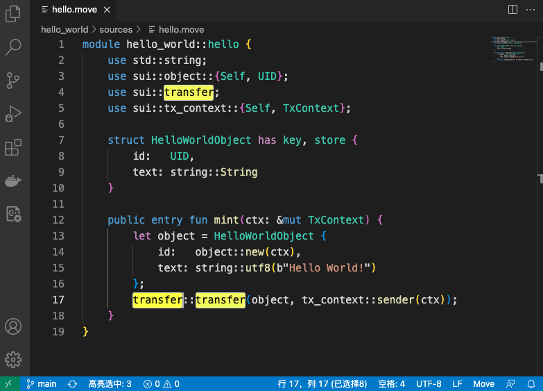

# highlight-selection README

The extension highlight the selected text based on the configuration, like color, case sensitive, whole word matching and etc. It also counts the occurrences of the highlighted text, the result will be displayed in the status bar.

## Features



## Extension Settings

```
highlight-selection.borderWidth:       "1px"           // default: "1px"
highlight-selection.borderRadius:      "3px"           // default: "3px"
highlight-selection.borderColor:       ""              // default: ""
highlight-selection.backgroundColor:   "yellow"        // default: "yellow"
highlight-selection.alignment:         "left or right" // default: "left"
highlight-selection.priority:          100             // default": 100
highlight-selection.caseSensitive:     true            // default": true
highlight-selection.wholeWordMatching: true            // default": true
highlight-selection.wordSeparators:    ""              // default": ""
```

**Enjoy!**
